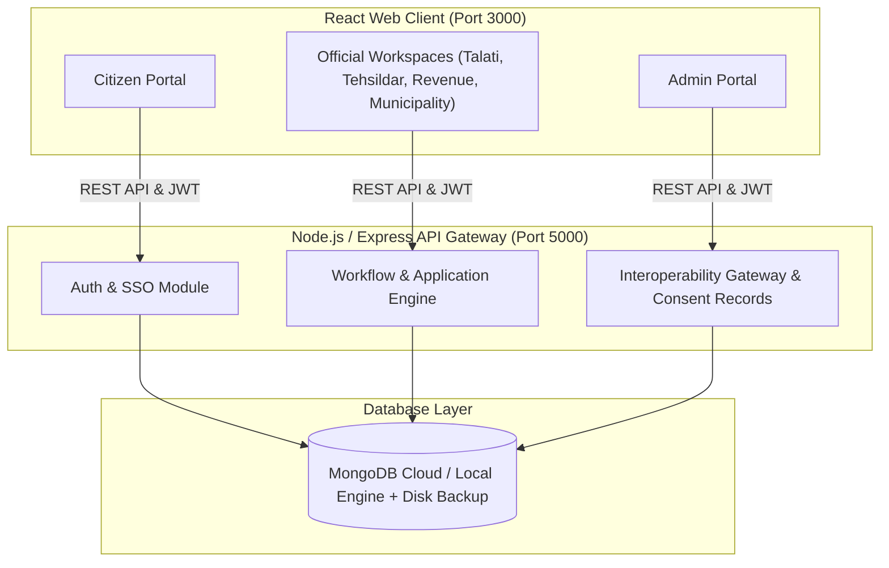

# 🏛️ GovConnect Interoperability Platform
> **Empowering Residency & E-Governance Services using MERN Stack**

GovConnect is a centralized, interoperable e-Governance platform designed to streamline residency verification, municipal services, revenue administration, and citizen-government interactions. Built on the MERN stack (MongoDB, Express, React, Node.js), it provides unified workflows across multiple administrative portals (Municipal, Tehsildar, Revenue, Talati).

---

## 🚀 Quick Start Guide

### Prerequisites
- [Node.js](https://nodejs.org/) (v16.x or later)
- [npm](https://www.npmjs.com/) (v8.x or later)

### 1-Command Automatic Setup & Execution
From the root directory of the project, run:

```bash
# 1. Install all dependencies across root, backend, and frontend
npm run setup

# 2. Start both Backend Server and Frontend React App concurrently
npm run dev
```

That's it!
- 💻 **Frontend Portal**: [http://localhost:3000](http://localhost:3000)
- 🌐 **Backend API Gateway**: [http://localhost:5000](http://localhost:5000)

---

## 🔑 Pre-seeded Demo Credentials

When the backend starts for the first time, demo accounts are automatically seeded into the database:

| Portal / Role | Email Address | Password | Privileges |
| :--- | :--- | :--- | :--- |
| **State Admin** | `admin@egram.com` | `Admin@123` | Master system access, user management, audit logs, analytics |
| **Official Verification Cell** | `official@egram.gov.in` | `Official@123` | Departmental verification, document approval, inter-office workflows |
| **Citizen Demo User** | `citizen@example.com` | `Citizen@123` | Citizen portal, application submission, status tracking, certificate downloads |

---

## 🏗️ System Architecture



---

## 📁 Repository Structure

```
├── backend/                  # Express REST API Server
│   ├── config/               # DB connection & seed scripts
│   ├── controllers/          # Business logic handlers
│   ├── middleware/           # Auth, API gateway & error handlers
│   ├── models/               # Mongoose data schemas (User, Application, etc.)
│   ├── routes/               # Modular API endpoint definitions
│   ├── utils/                # Utility helpers (email, validation)
│   └── server.js             # Main server entry point
│
├── frontend/                 # React SPA Frontend
│   ├── src/
│   │   ├── components/       # Reusable UI widgets & Navbar
│   │   ├── context/          # Toast & App contexts
│   │   ├── pages/            # Citizen, Official & Admin Portal views
│   │   └── App.js            # Main route definition
│   └── package.json
│
├── package.json              # Root launcher scripts (concurrently)
├── start-dev.bat             # 1-click Windows execution batch script
└── README.md                 # Project documentation
```

---

## 🛠️ Key Scripts

| Command | Description |
| :--- | :--- |
| `npm run setup` | Installs root, backend, and frontend dependencies in one command. |
| `npm run dev` | Runs backend (Port 5000) and frontend (Port 3000) concurrently. |
| `npm run dev:backend` | Starts only the Express backend API server with nodemon. |
| `npm run dev:frontend` | Starts only the React frontend web application. |
| `npm run seed` | Manually triggers initial database seeding script. |

---

## 🌟 Key Features

1. **Interoperable Multi-Office Workflows**: Seamlessly routes residency and civic applications across **Talati**, **Tehsildar**, **Revenue**, and **Municipal** officers.
2. **Local Database Fallback**: Built-in zero-config database engine (`mongodb-memory-server` with persistent JSON backup) so the app runs out of the box even without cloud MongoDB credentials.
3. **Automated Verification & Status Tracking**: Live application status timelines, document uploads, and automated verification flags.
4. **Role-Based Access Control (RBAC)**: Enforces role permissions across Citizens, Office Departmental Officials, and State Administrators.
5. **Multilingual & Responsive UI**: Clean interface built with Tailwind CSS, React Icons, and i18n support.

---

## 📄 License
This project is developed for educational and hackathon submission purposes (SIH / E-Governance Initiative).
